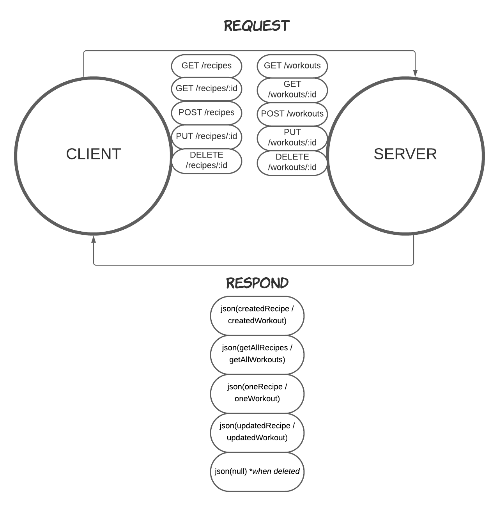

# LAB - Class 03  

## Project: Express REST API

### Author: Yuliya Barysevich

### Links and Resources

1. Deployed with Heroku (2 routes)
    - [https://barysevich-basic-api-server.herokuapp.com/recipes](https://barysevich-basic-api-server.herokuapp.com/recipes)
    -  - [https://barysevich-basic-api-server.herokuapp.com/workouts](https://barysevich-basic-api-server.herokuapp.com/workouts)

2. Github URLs
    - [https://github.com/YuliyaBarysevich/basic-api-server/runs/2406644349](https://github.com/YuliyaBarysevich/basic-api-server/runs/2406644349)
    - [https://github.com/YuliyaBarysevich/basic-api-server/pull/1](https://github.com/YuliyaBarysevich/basic-api-server/pull/1)

### Setup

- **.env requirements** 
i.e.
  - PORT - Port Number

### How to initialize/run your application

- Download all dependencies `npm install`
- Create **.env** file and assign **PORT** variable to 3000
- Run command `nodemon` in terminal to start app on localhost:3333
- To run tests, run command `npm run test` in terminal

### Tests

- 404 on a bad route
- 404 on a bad method
- 500 errors handler
- 200 if routes work properly
- 201 if POST / route (update) works properly

### WRRC

